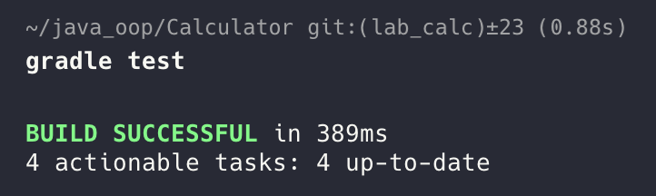
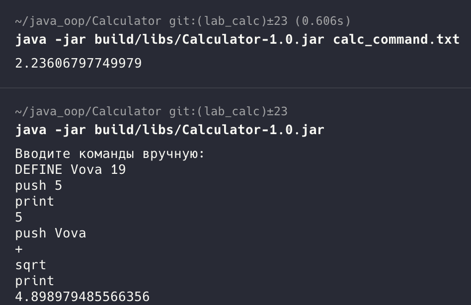

# Stack Calculator

## How to use

##### Git clonde -> install the dependencies -> start App

```sh
gradle build
java -jar build/libs/Calculator-1.0.jar
```

##### Widh file

```sh
gradle build
java -jar build/libs/Calculator-1.0.jar calc_command.txt
```

##### Running tests separately

```sh
gradle test
```

#### You can check logs in _logs/app.log_ (for example):
```
22:19:58.061 [main] WARN  main.java.CalcContext -- Ошибка ввода: Невозможно извлечь корень из отрицательного числа
22:20:45.099 [main] WARN  main.java.CalcContext -- Ошибка ввода: Неизвестная команда: test228
22:21:22.621 [main] WARN  main.java.CalcContext -- Ошибка ввода: Push command requires a number
```

## Tests:


## Example work:
